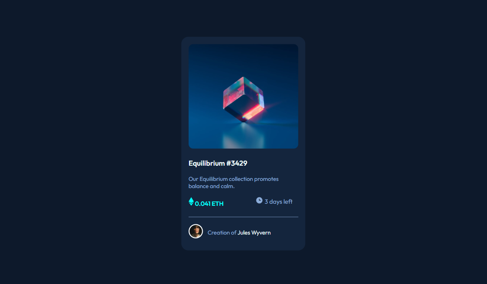

# Frontend Mentor - NFT preview card component solution

## Table of contents

- [Overview](#overview)
  - [The challenge](#the-challenge)
  - [Screenshot](#screenshot)
  - [Links](#links)
  - [Built with](#built-with)
  - [Continued development](#continued-development)
  - [Useful resources](#useful-resources)
- [Author](#author)

## Overview

### The challenge

Users should be able to:

- View the optimal layout depending on their device's screen size

### Screenshot

### Links

- Solution URL: [Github](https://github.com/LexTarasov/MyFrontend-Mentor-Challenges)

### Built with

- Semantic HTML5 markup
- CSS custom properties
- CSS Grid
- Mobile-first workflow

### Continued development

For my future projects i want to have a better understanding of css-grid for responsive design.

### Useful resources

Google fonts 

## Author

- Frontend Mentor  - [@LexTarasov](https://www.frontendmentor.io/profile/LexTarasov)

